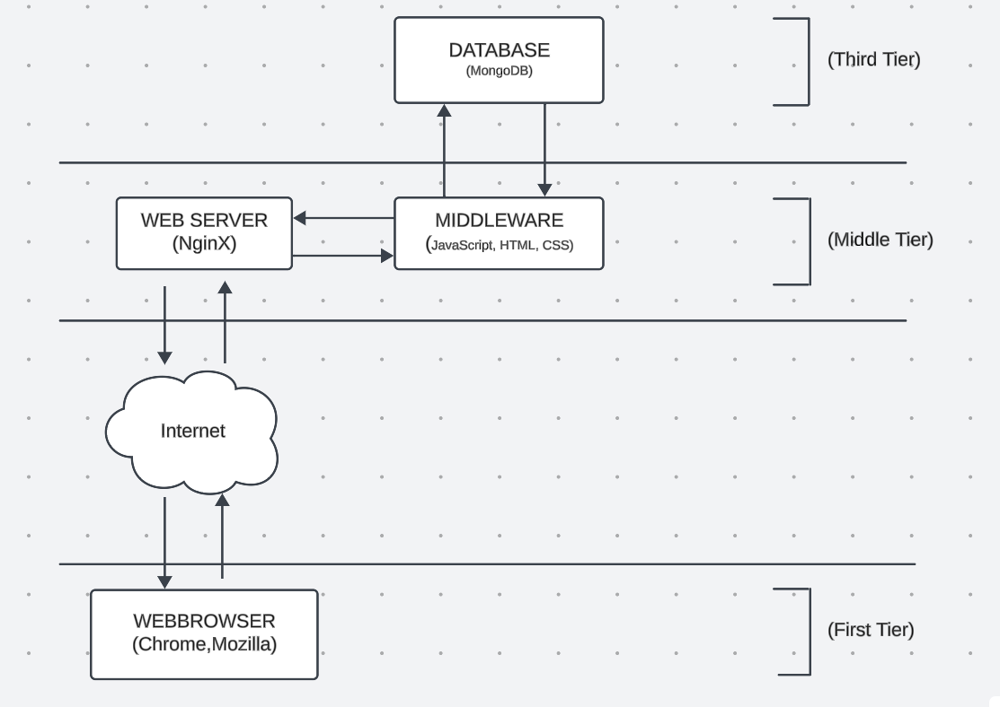
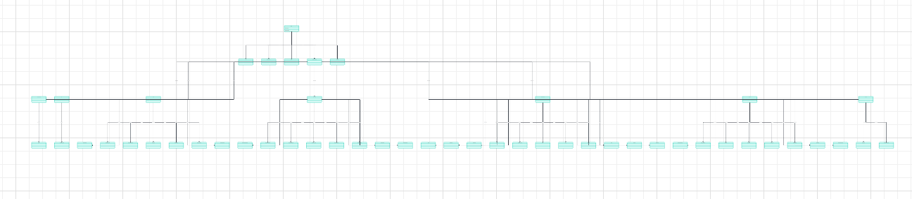

>Arkitektur och systemdesignen är till för att alla inblandade i projektet enkelt ska kunna få en överblick över systemets arkitektur och vilka delar som är inblandade.
I vissa projekt med en komplex övergripande arkitektur är detta dokument mycket viktigt, medan i enklare applikationer kommer det kanske inte att tillföra så mycket. 
>
>Illustrera gärna den övergripande arkitekturen med en eller flera bilder.

