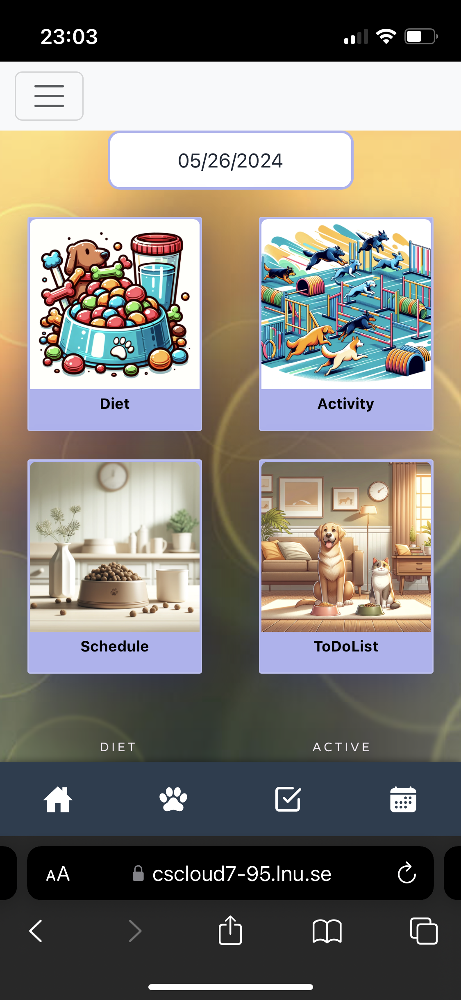
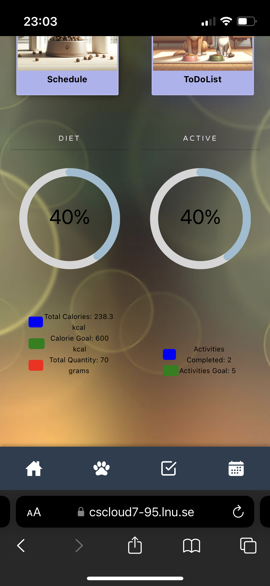
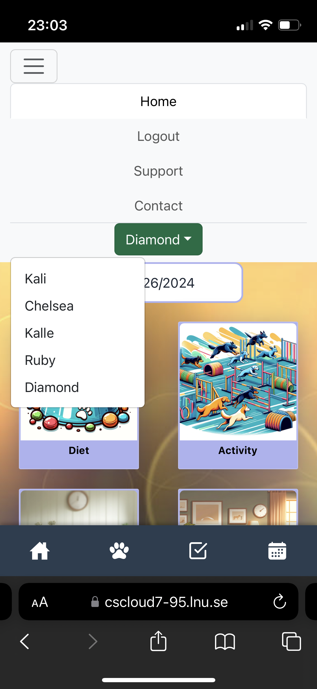

# Petsee

### Författare: Erik Yang
### Datum: 2024-05-26

## Abstract

## Introduction and Background
I have developed an application called Petsee. The purpose of the application is for users to be able to oversee and monitor different aspects of their pet's life. They include diet, activity, schedule and a to-do list. There are also two progress bars visual to the user to enhance user experience and to improve readability over diet and activites. One of the aspects of my application is that after each day, my application resets the added meals and activities for a specific pet. The reason for this is so that the user can go back in time and specifically choose a date and see what meals and activites the pet did on a certain date. This is helpful in diagnosing any anomolies in the pet's health or mood. Another reason for the reset is because when the user adds a new pet, they also need to give information about how many calories the pet needs to eat per day and the amount of actitivies the pet needs to do per day. Because of the reset of added meals and activites each day, it ensures that the user is up to date with the progress of the pet during each day. Also the progress bars help users monitor the daily progress. 

Another feature of my application is that the user can add multiple pets and switch between them. My code is fitted so that each unique pet get meals and activites added to them specifically. This way, the user can add multiple pets and easily switch pet in the drop down menu in order to retrieve the other pets' information.

My application is also fitted with a calendar with schedule features. This means that the user can access the calendar, choose any date and add a note for that specific date. The user can choose do add, edit or delete any note. The use can for example add veterinary visits, play dates and other useful things.

Furthermore I added a to-do list to my application. Since having a pet/pets means caring and planning for them, a to-do list would be useful to have. The user is able to add a new task and the tasks appear on a dashboard. The user is then able to edit, delete and mark a task as "completed" if they choose to. 

The schedule and to-do list features are not depentent of a specific pet, rather than a specific user. That is why the calendar and the to-do list is universally used for the same user, as apposed to when adding meals or activites, that are specific to a certain pet.

My approach to planning, building, testing and deploying the application are mainly based on agile methods. I worked with the help of weekly sprints and iterations, as we had weekly standup meetings with a group of fellow students and a supervisor.

For the front end of my application I used React. For the backend I used MongoDB, express and node js. (MERN stack)

From the very onset, my goal was to create a PWA (progressive webb application). They are very flexible in terms of adjusting to different screens, whether it is a desktop screen, a laptop, an ipad or an iphone. That is why I developed my application with the thought on responsiveness to different screen sizes from the very beginning and always made sure that the user interface worked properly, especially on a phone screen.

  

## Positives

Although I am generally very satisfied of the overall design and implementation of my appliaction, I feel a bit extra proud that I can actually use it on my phone. This was one of the objectives I had in mind from the very start. Since I have two dogs, my ambition was always to try and use the application for my own dogs and I developed the functionality of the application from a practicallity point of view that I know alot of dog owners would appreciate. That is why I put so much emphasis in making sure that the interface would work properly on a smaller screen, such as an iphone. This meant that in every step of my developement process, after every change that I made, I had to make sure that it also worked on a smaller screen. I am very happy that I did this from the very onset, because even though I took precautions in making sure it all worked on a phone screen, there were still issues that arose that took a very long time to solve. On one hand it all looks fine and correct on a desktop screen, but as the screen gets smaller, the html elements have a tendancy to re-arrange themselves in a way that usually does not look good at all from a user interface point of view. I cannot image how I would have been able to solve it (if at all), had I opted to develop the whole application without the responsiveness in mind, and then try to retrofit the responsive properties.

Since it was my first time working with React, I didn't really know what to expect. Now in hindsight I am really glad that I did. It turns out that React has a much simpler way of calling and implementing functions from other components and a way of using the components' various states as well. Another plus is that many of the React Bootstrap components that I used for the interface, are responsive in their nature. This meant that I didn't have to battle as much with Grid, row and column layout as much, had I opted to use vanilla CSS.

In future projects I will defintely have React in mind, since it's syntax and workflow allow for a much smoother and effective developing experience compared to vanilla javascript.

When it comes to the backend, I am glad that I managed to figure out all the different fetch calls and routes. I divided my code into many easy readable and easy to find components, such as controllers, routes and models to increase readability. Overall I am happy in how I managed to organize my different components. This is a practise that I will continue to do in the feature, as it also makes finding bugs and errors easier.

## Negatives

I feel that I should have started working with automated tests and CD/CI a bit earlier than I did. Although I managed to create several unit and acceptance tests (e2e) that work properly, there were also a few that did not start or work as expected. I did want to create both unit tests and e2e tests for every different major part of my application/code, but did not manage to get them all to work. I believe that If I had started with the automated tests ealier, and perhaps skipped formulating so many manual tests/use cases, that would have gave me more time in developing the automated tests. 

## Summary

To summarize, I am overall very happy about how my first semi-big indepentent developing project went. The Petsee application came out good with all of the desired functions available and working correctly. The user is able to register a new account and log in. After succesfull login, the user is able to add pet/pets and switch between them when adding meals and activities. The circular progress bars display the daily progress and goal for the selected pet. The ability to go back in time and choose any date and display information for that specific date, help contribute to a better overall monitoring experience and diagnosing health anomolies amongst the pets.  The calendar and to-do list functions add practicality to the application when it comes to planning and caring for the pet/pets.

I experienced many positives during my developing process. First of all I learned how to use agile methods in planning and writing my code. Furthermore, I managed to fit Petsee to work properly on my iphone screen, by keeping the responsiveness aspect in mind from the very onset. I learned how to use and leverage the framework React and see many opportunities of working with it in future projects. When it comes to the backend I further developed my working skills with frameworks such as node js, express and mongoDB.

One of the negative things was that I should have started earlier with the automated tests. I did not leverage the positives of having automated tests set up early in my project as I opted for writing alot of tests/user cases manually instead. I believe that If I have realized this earlier, I could have formulated more and better unit and acceptance (e2e) tests.

I have learned so much during this developing process. Everything from agile methods, to learning how to use new frameworks/libraries such as React and Jest (for automated testing). I further developed my knowledge in organizing and structuring a project as well as finetuning my skills on the backend and server part. I continue to see myself growing and learning as a developer as I really enjoy learning how to use new frameworks and find satisfaction when frontend comes together as a whole with the backend.

Futhermore, I also see continued development opportunities for the Petsee application. As I will use if for my own dogs, I will be able to find bugs and further enhance the application with even more functions.