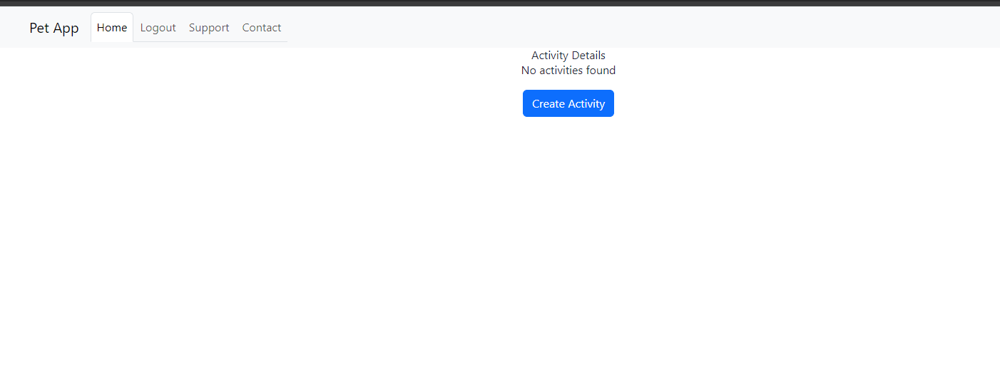
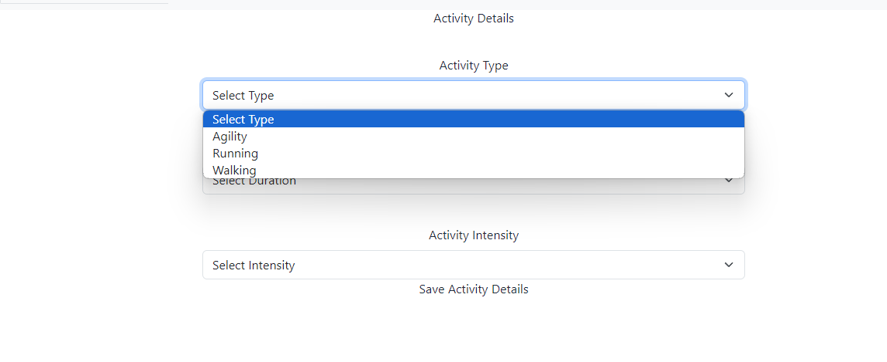
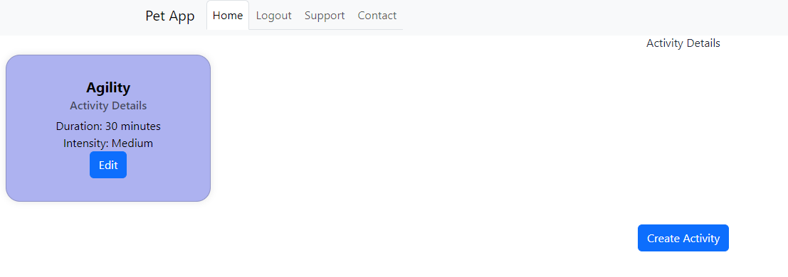
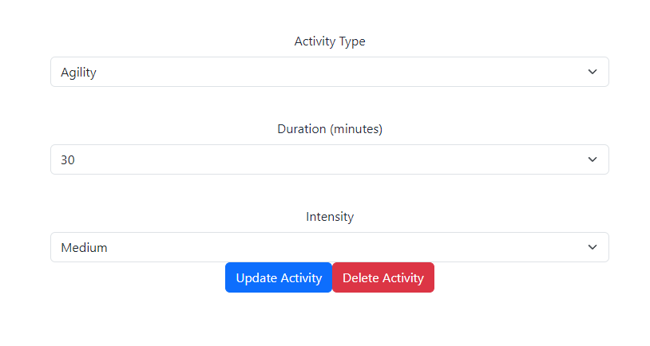
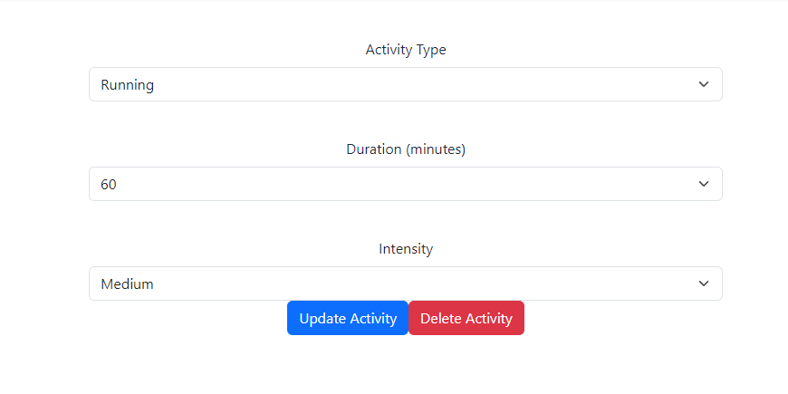
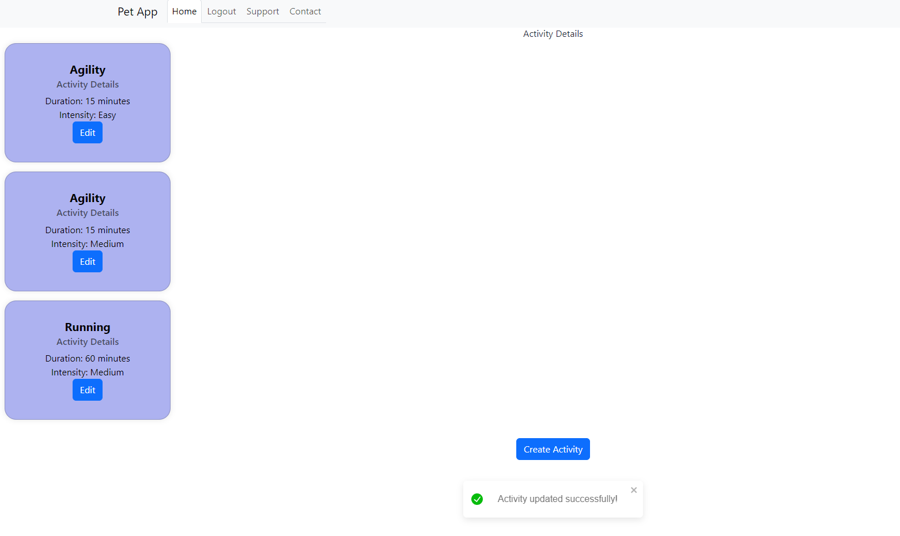
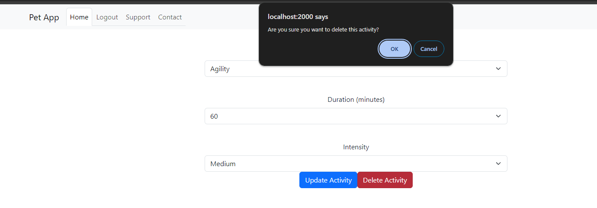
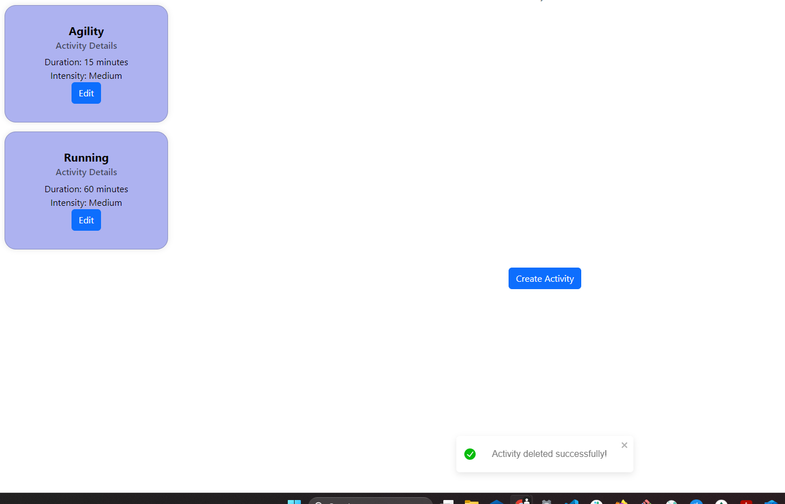

# Test Report for Activity Management

## 2024-04-20

### Test Environment
- **Development Tools:** VSCode
- **Browser:** Google Chrome
- **Database:** MongoDB
- **Framework:** [React, MongoDB, node.js, express]

### Test Suite: Activity Management

#### Test Case 6.1: Add New Button
**Objective:** Verify that the URL for adding activities works and that a button to "create activity" is displayed.
- **Input:** Log in and navigate to the "activitydetails" section.
- **Expected Output:** A new page is opened. A create button is displayed.
- **Result:** [Pass]
- **Screenshots:** 
- **Comments:** [Any additional notes]

#### Test Case 6.2: Add New Activity Form
**Objective:** Verify that users can add activities for their pets through dropdown menus.
- **Input:** Log in and navigate to the activitydetails section. Choose activity details from dropdown (type, duration, intensity).
- **Expected Output:** User interface is displayed where the user can choose activity from dropdown menus.
- **Result:** [Pass]
- **Screenshots:** 
- **Comments:** [Any additional notes]

#### Test Case 6.3: Add New Activity
**Objective:** Verify that users can save activities for their pets.
- **Input:** Log in and navigate to the activitydetails section. Choose activity details from dropdown (type, duration, intensity). Save the activity.
- **Expected Output:** Activity is added to the "activitydetails" page. Displays the new activity.
- **Result:** [Pass]
- **Screenshots:** 
- **Comments:** [Any additional notes]

#### Test Case 6.4: Edit Activity
**Objective:** Verify that users can edit activities for their pets.
- **Input:** Log in and navigate to the activitydetails section. Choose activity and press the "edit" button.
- **Expected Output:** User is redirected to an "edit" url for the specified activity. Displays Buttons for "update activity" and "delete activity".
- **Result:** [Pass]
- **Screenshots:** 
- **Comments:** [Any additional notes]

#### Test Case 6.5: Update Activity
**Objective:** Verify that users can update activities for their pets.
- **Input:** Log in and navigate to the activitydetails section. Choose activity and press the "edit" button. Change duration to 60. Press the "update activity" button.
- **Expected Output:** User is redirected to the activitydetails url and the activity is updated. Displays A message "update successful" is displayed.
- **Result:** [Pass]
- **Screenshots:**  
- **Comments:** [Any additional notes]

#### Test Case 6.6: Delete Activity
**Objective:** Verify that users can delete activities for their pets.
- **Input:** Log in and navigate to the activitydetails section. Choose activity and press the "edit" button. Click the "delete" button.
- **Expected Output:** A warning is displayed warning the user about the deletion. User is redirected to the activitydetails url and the activity is deleted. Displays A message "delete successful" is displayed.
- **Result:** [Pass]
- **Screenshots:**  
- **Comments:** [Any additional notes]

### Summary
- **Overall Success Rate:** [6 out of 6]
- **General Comments:** Implementing React Toast/ToastContainer for the flash messages. Overall the routes, the fetching, the schemas and the interface works. Needs more improvement with the UI ofcourse.

