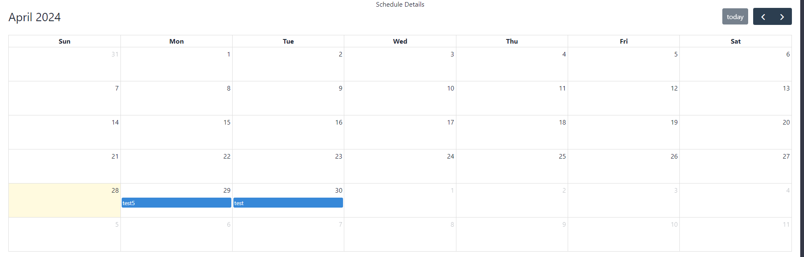
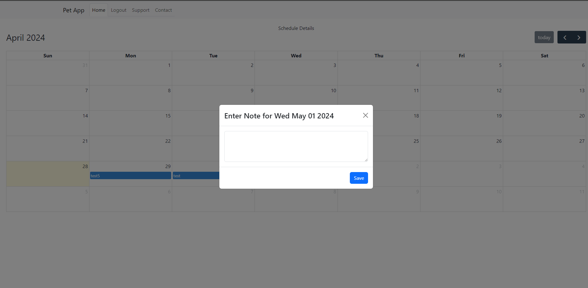
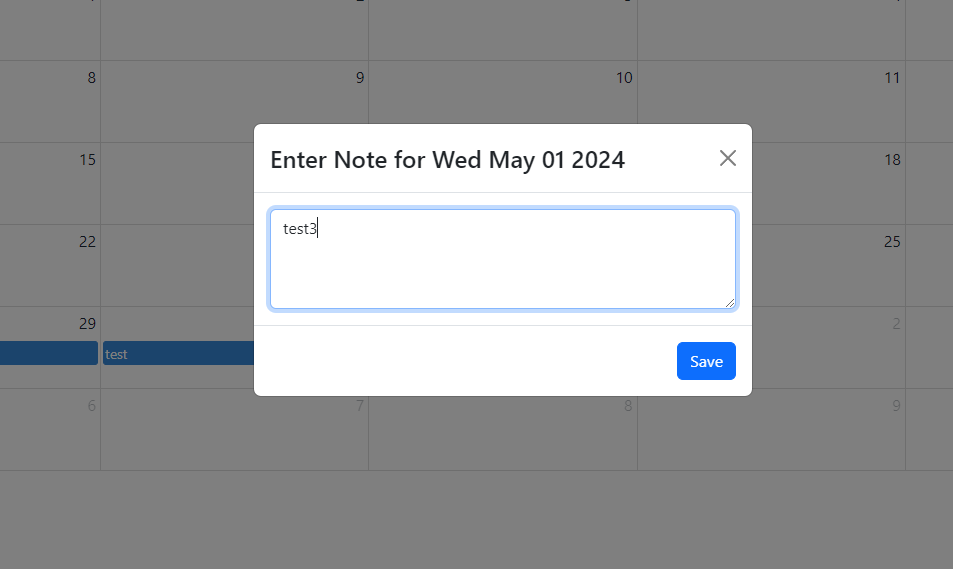
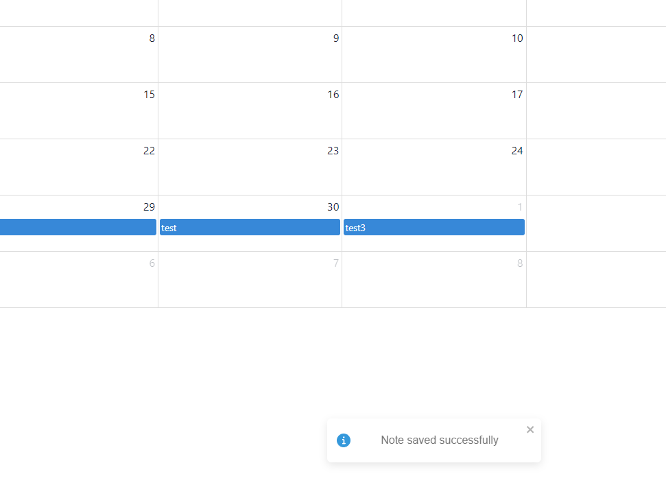
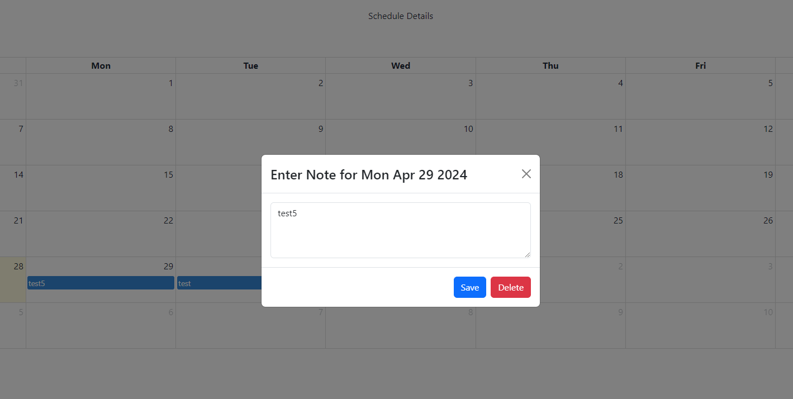
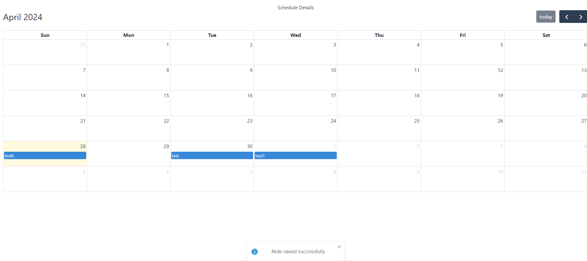
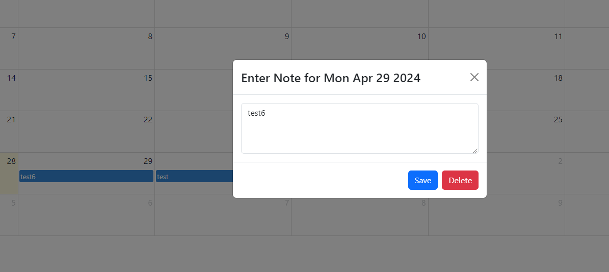

# Test Report for Schedule Management

## 2024-04-28

### Test Environment
- **Development Tools:** VSCode
- **Browser:** Google Chrome
- **Database:** MongoDB
- **Framework:** [React, MongoDB, node.js, express]

### Test Suite: Schedule Management

#### Test Case 7.1: Add New Button
**Objective:** Verify that the URL for adding schedules works and that a button to "create schedule" is displayed.
- **Input:** Log in and navigate to the "scheduledetails" section.
- **Expected Output:** A new page is opened. A create button is displayed.
- **Result:** [Fail]
- **Screenshots:** 
- **Comments:** Instead of showing a button, the user can directly press a date in the calendar.

#### Test Case 7.2: Add New Schedule Form
**Objective:** Verify that users can add schedules for their pet through a form interface.
- **Input:** Log in and navigate to the "scheduledetails" section. Choose a date and click it.
- **Expected Output:** User interface is displayed in the form of a modal, where the user can add a note.
- **Result:** [Pass]
- **Screenshots:** 
- **Comments:** [Any additional notes]

#### Test Case 7.3: Add New Schedule
**Objective:** Verify that users can save schedules for their pets.
- **Input:** Log in and navigate to the "scheduledetails" section. Choose date and write a note. Save the schedule.
- **Expected Output:** New note is added to the calendar on the "scheduledetails" page. Displays the calendar.
- **Result:** [Pass]
- **Screenshots:**   
- **Comments:** [Any additional notes]

#### Test Case 7.4: Edit Schedule
**Objective:** Verify that users can edit schedules for their pets.
- **Input:** Log in and navigate to the scheduledetails section. Choose the schedule note test5 and click it.
- **Expected Output:** User is redirected to a modal. Displays Buttons for "save" and "delete".
- **Result:** [Pass]
- **Screenshots:** 
- **Comments:** [Any additional notes]

#### Test Case 7.5: Update Schedule
**Objective:** Verify that users can update schedules for their pets.
- **Input:** Log in and navigate to the scheduledetails section. Choose a note test5 on the calendar and click it. Change the note as needed. Press the "save" button.
- **Expected Output:** User is redirected to the scheduledetails url and the calendar is updated. Displays a message "update successful".
- **Result:** [FAIL]
- **Screenshots:** 
- **Comments:** The note is changed correctly, but for some reason the note jumps to the previous day. After page refresh it shows correctly again.

#### Test Case 7.6: Delete Schedule
**Objective:** Verify that users can delete schedules.
- **Input:** Log in and navigate to the scheduledetails section. Choose the note test6 on the calendar and click it. Click the "delete" button.
- **Expected Output:** User is redirected to the scheduledetails url and the note is deleted from the calendar. Displays a message "delete successful".
- **Result:** [PASS]
- **Screenshots:**  (./screenshots/TC7.6.2.png)
- **Comments:** [Any additional notes]

### Summary
- **Overall Success Rate:** [4 out of 6]
- **General Comments:** The logic for adding, editing and deleting a note in the calendar seems to work fine. The only issue was that when updating a note, the note displays on the previous day mometarily, before page refresh.

