## Test Report for Multiple Pets

## 2024-05-05

### Test Environment
- **Development Tools:** VSCode
- **Browser:** Google Chrome
- **Database:** MongoDB
- **Framework:** [React, MongoDB, node.js, express]

### Test Suite: Multiple Pets

### Test Case 8.1: Add New Pet
**Objective:** Verify that the user can add a new pet.
- **Input:** Log in and navigate to the "more" section. Choose "Add a pet". Enter "Test" as the name of the pet. Save the new pet.
- **Expected Output:** A new pet named "Test" is added to the "more" page. The new pet "Test" is displayed.
- **Result:** [PASS]
- **Screenshots:** 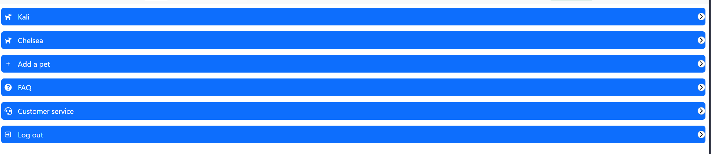 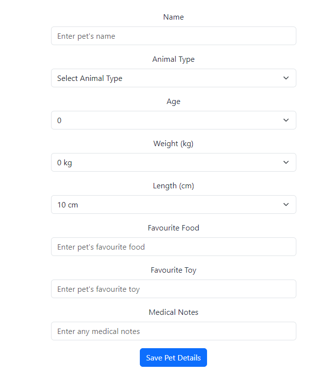 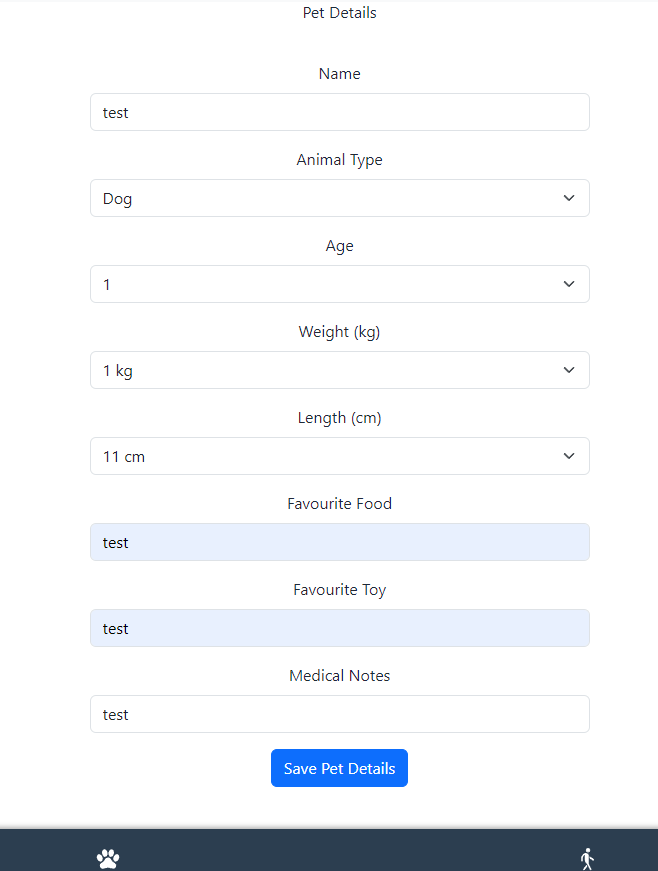 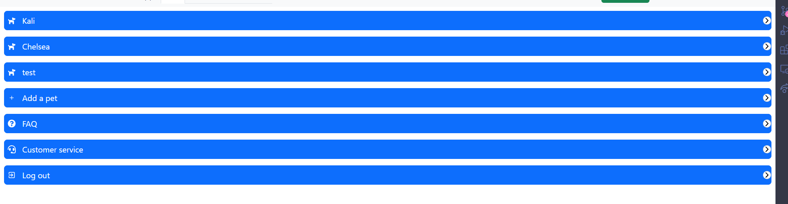
- **Comments:**

### Test Case 8.2: Button/Dropdown for Multiple Pets
**Objective:** Verify that the user sees a button for switching between pets.
- **Input:** Log in.
- **Expected Output:** A button for selecting a pet should be visible to the user at all times.
- **Result:** [PASS]
- **Screenshots:** 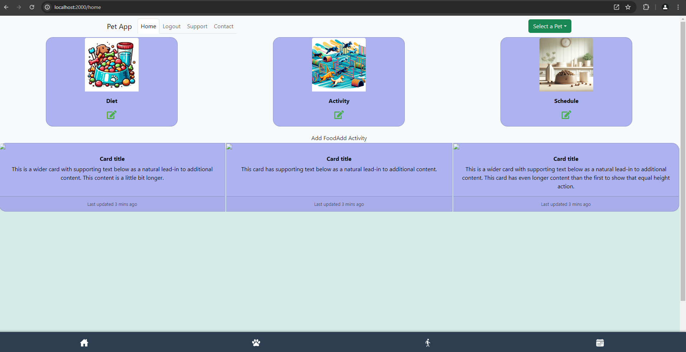 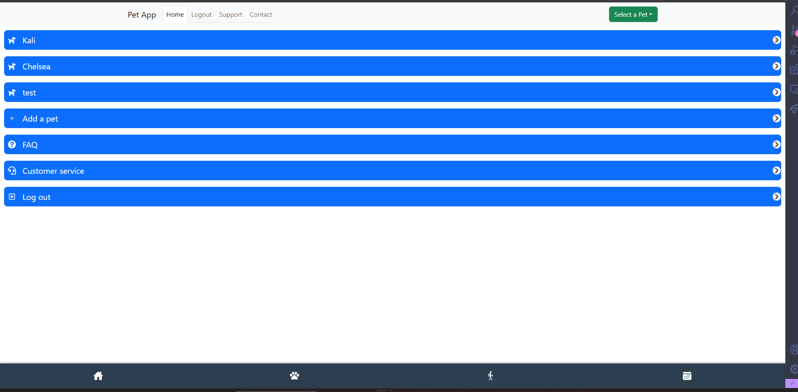 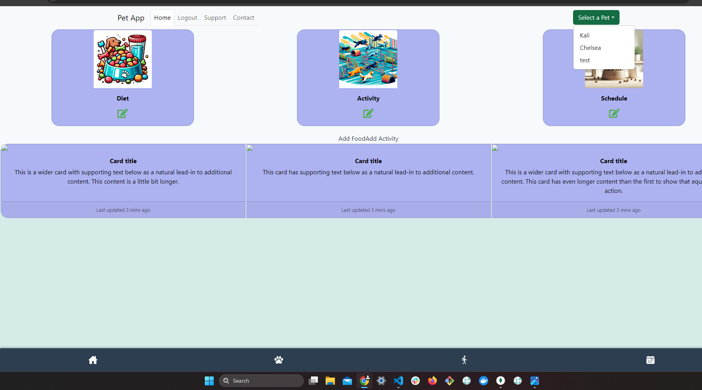
- **Comments:**

### Test Case 8.3: Display Information for Specific Pet
**Objective:** Verify that only the saved information for the selected pet is displayed.
- **Input:** Navigate to "dietdetails". Choose "Kali" as the selected pet.
- **Expected Output:** The saved meals for the pet "Kali" should be displayed.
  - **Input:** Switch selected pet to "Chelsea".
  - **Expected Output:** The saved meals for the pet "Chelsea" should be displayed.
- **Result:** [PASS]
- **Screenshots:** 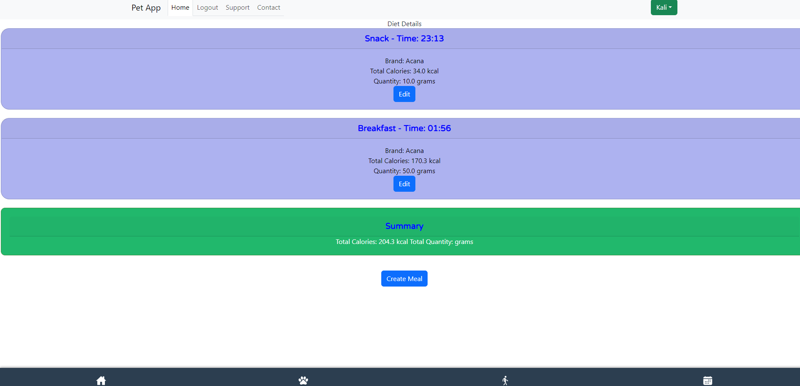 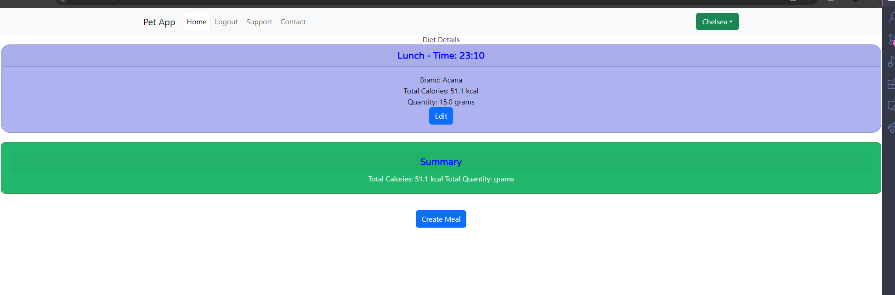
- **Comments:**

### Test Case 8.4: Add Information for Specific Pet
**Objective:** Verify that only the saved information applies to the selected pet.
- **Input:** Navigate to "dietdetails". Choose "Kali" as the selected pet. Click the "Create meal" button. Create a meal and save it.
- **Expected Output:** The new meal should only be displayed for the pet "Kali".
- **Result:** [PASS]
- **Screenshots:** 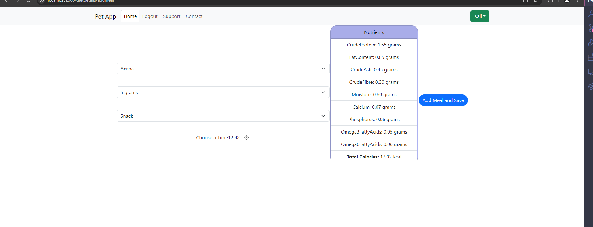 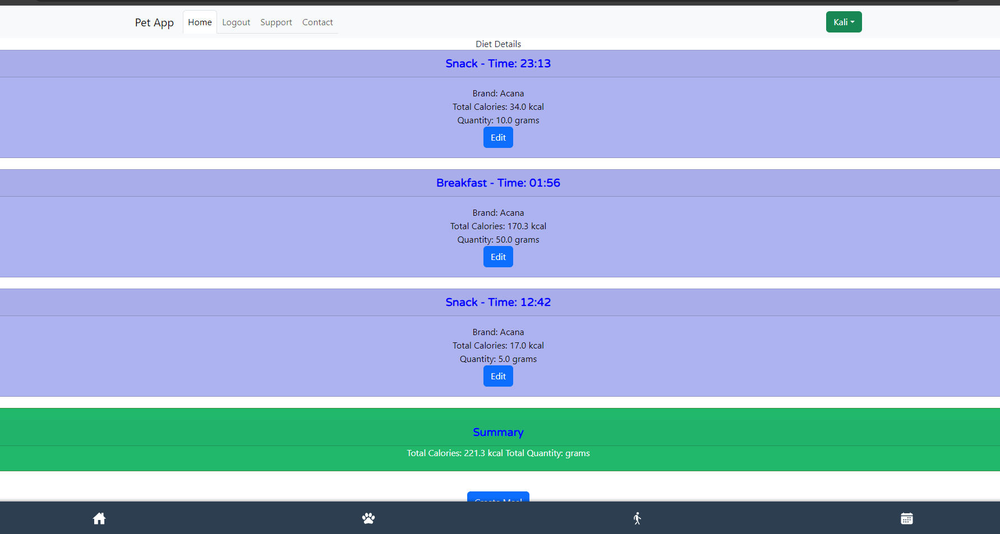  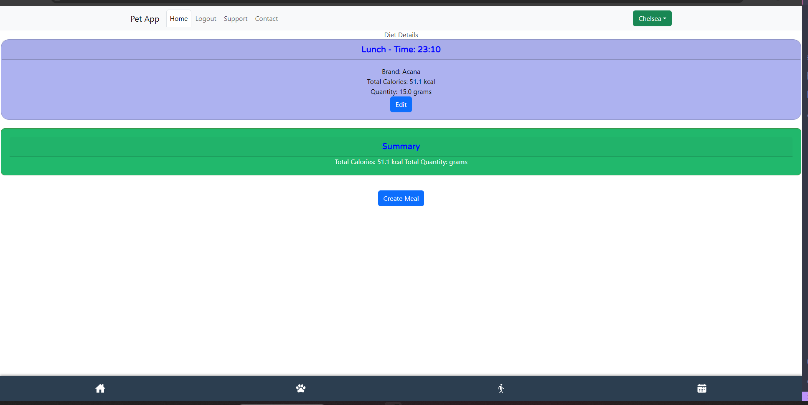 
- **Comments:**
### Summary
- **Overall Success Rate:** [4 out of 4]
- **General Comments:** The logic for switching between different pets is working. The logic for only displaying the selected pet's information is working correctly for the dietdetails and the meals.