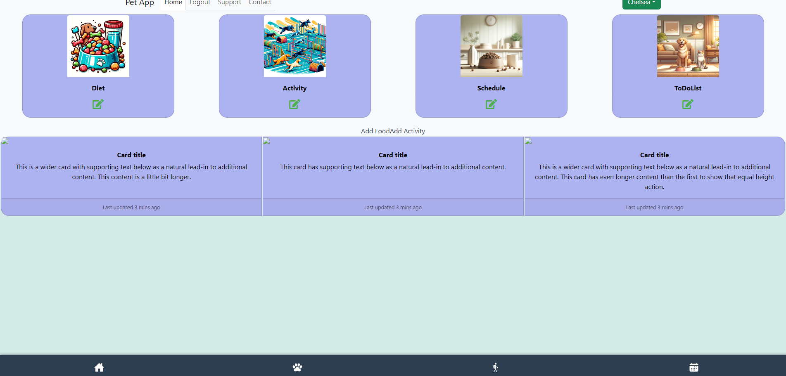
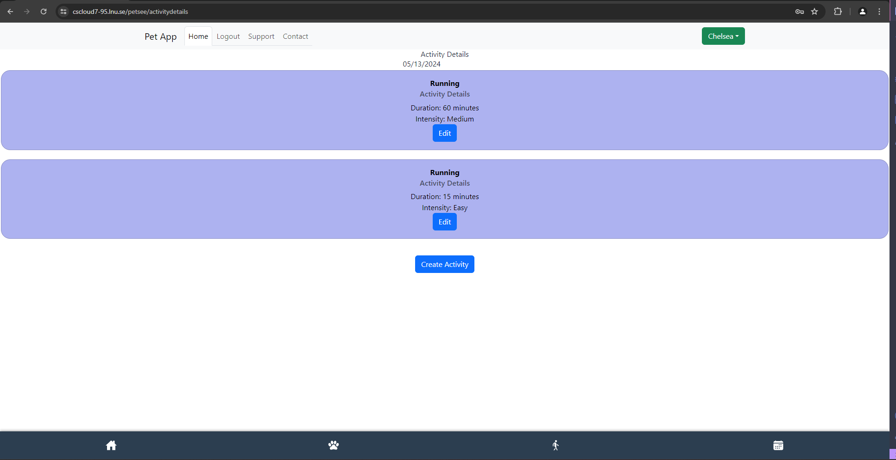
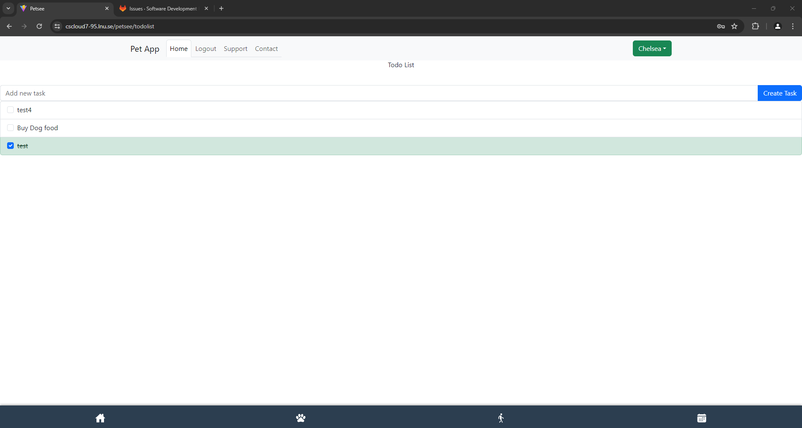
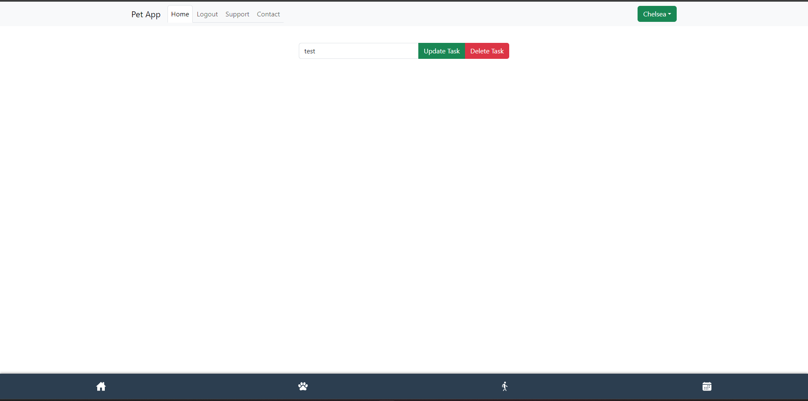
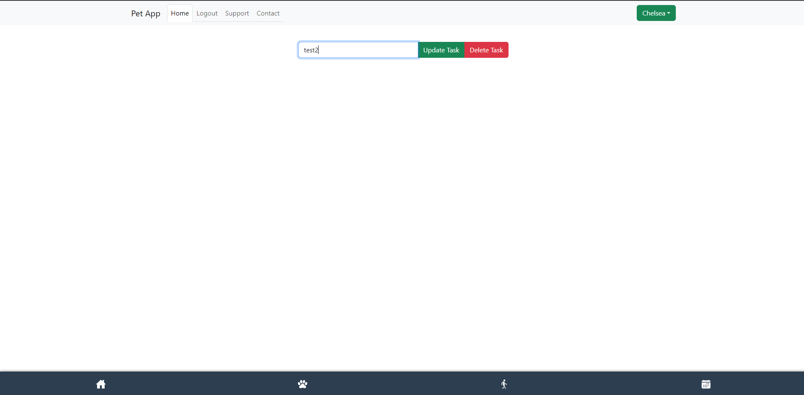
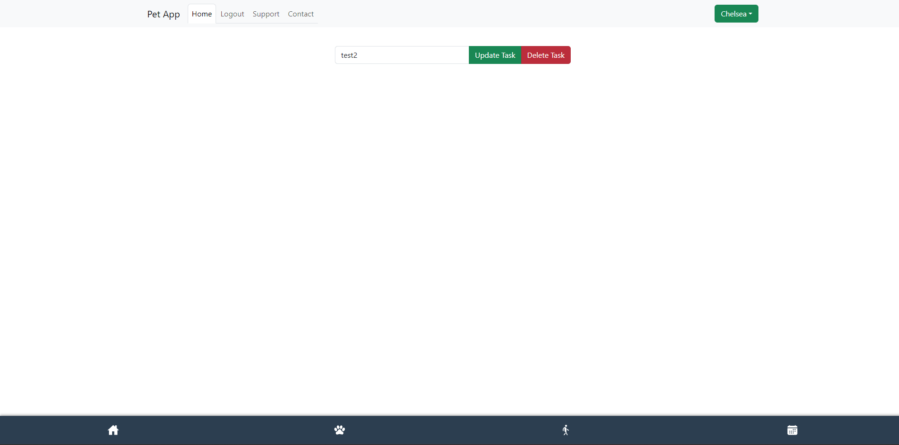
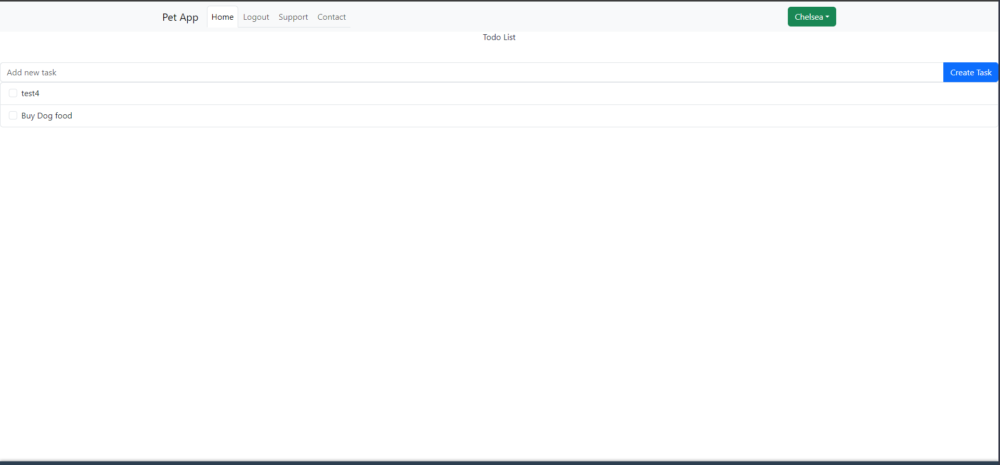

## Test Report for To-do List

## 2024-05-14

### Test Environment
- **Development Tools:** VSCode
- **Browser:** Google Chrome
- **Database:** MongoDB
- **Framework:** [React, MongoDB, node.js, express]

### Test Suite: Multiple Pets

### Test Case 10.1: To-do List function
**Objective:** Verify that a To-Do list function displays on the application.
- **Input:** Log in.
- **Expected Output:** Displays a clickable card ToDoList.
- **Result:** [PASS]
- **Screenshots:** 
- **Comments:**

### Test Case 10.2: Create new task
**Objective:** Verify that the user can navigate to the To-do List page and create a new task
- **Input:** Log in and click on the ToDoList card. Input "test" in the input field and click the button "Create Task"
- **Expected Output:** The task "test" should display on the dashboard.
Displays the "test" task.
- **Result:** [PASS]
- **Screenshots:**  
- **Comments:**

### Test Case 10.3: checkbox to indigate if task is completed.
**Objective:** Verify that the user can click the checkbox next to the task name to indicate completion.
- **Input:** Log in and click on the ToDoList card.
CLick the checkbox next to the task "test"
- **Expected Output:** The checkbox should be filled and the task overwritten with a line indicating completion of the task.
Displays the changed state of the task.
- **Result:** [PASS]
- **Screenshots:**  
- **Comments:**

### Test Case 10.4: Edit task
**Objective:** Verify that the user can edit a task.
- **Input:** Log in and click on the ToDoList card.
Click on the "test" task.
Change text from "test" to "test2".
CLick the "Update Task button.
- **Expected Output:** The user should be navigated to the edit task page.
Displays the task with buttons to update or delete task.
The task should be updated with the new task "test".
Displays the updated task.
- **Result:** [PASS]
- **Screenshots:**    
- **Comments:**

### Test Case 10.5: Delete task
**Objective:** Verify that the user can delete a task.
- **Input:** Log in and click on the ToDoList card.
Click on the "test2" task.
CLick the "Delete" Task button.
- **Expected Output:** The user should be navigated to the edit task page.
Displays the task with buttons to update or delete task.
The task should be deleted and removed from the dashboard.
Displays the updated dashboard without the task "test2".
- **Result:** [PASS]
- **Screenshots:**    
- **Comments:**

### Summary
- **Overall Success Rate:** [5 out of 5]
- **General Comments:** The logic for the To-do List is working correctly. The user is able to add, edit and delete tasks. Aditionally, the user can check the check box of the task to indicate completion of task.