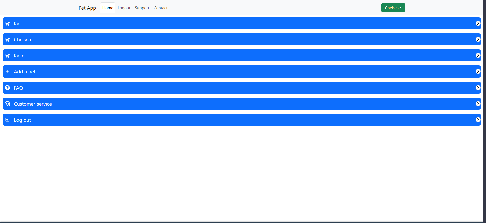
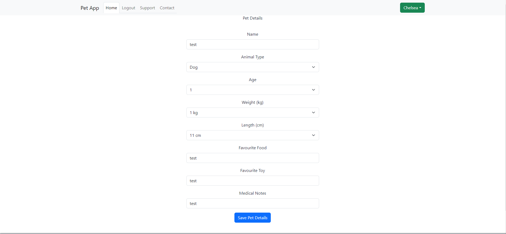
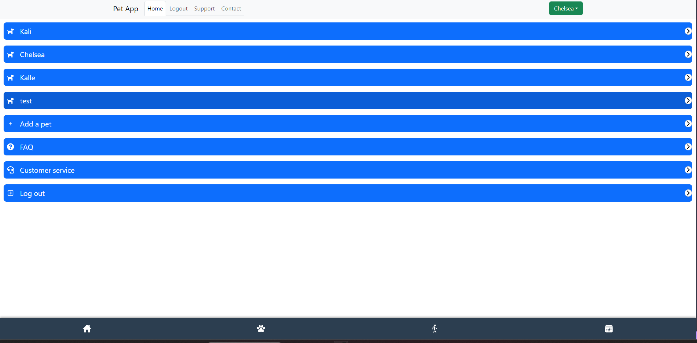
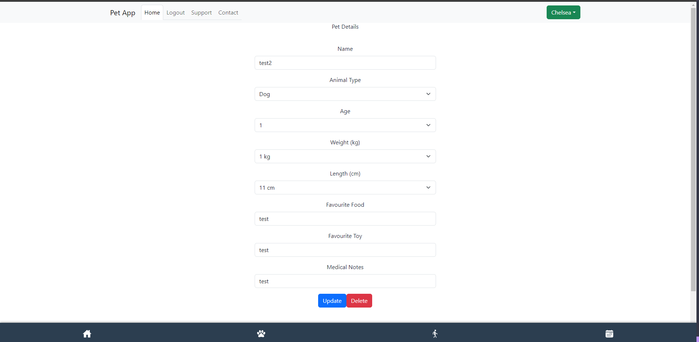
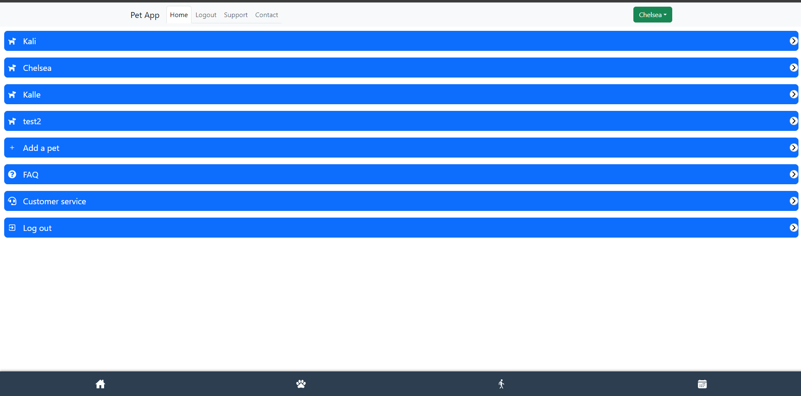
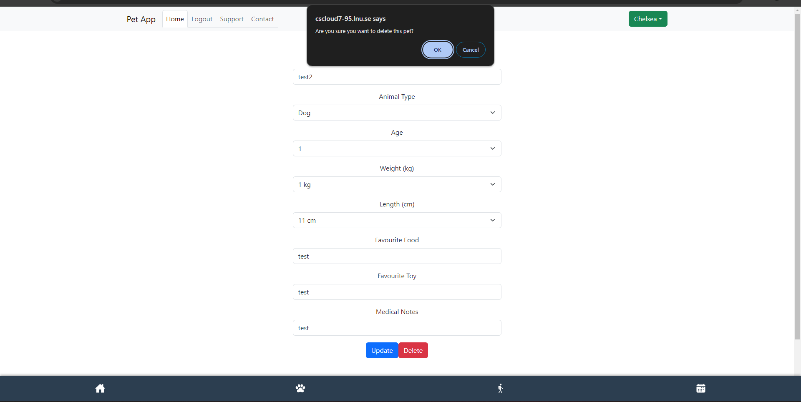
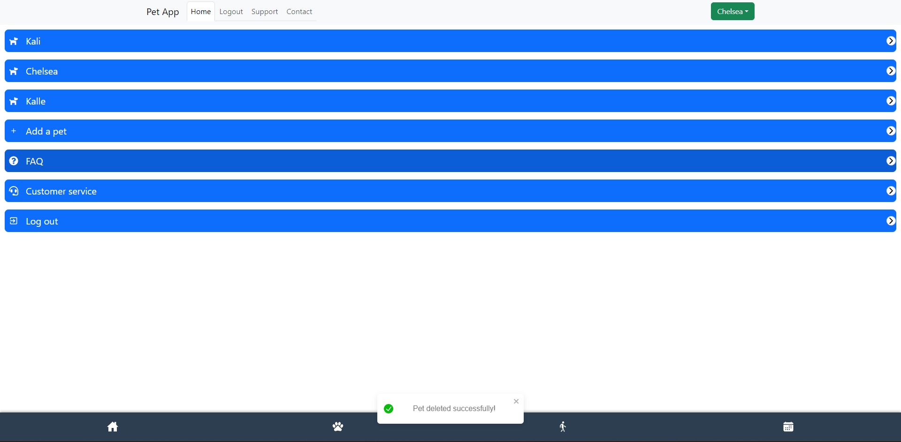

## Test Report for Pet Details Management

## 2024-05-14

### Test Environment
- **Development Tools:** VSCode
- **Browser:** Google Chrome
- **Database:** MongoDB
- **Framework:** [React, MongoDB, node.js, express]

### Test Suite: Pet Details Management

### Test Case 4.1: View Pet Details on More page
**Objective:** Verify that users can view details of their pets.
- **Input:** Log in successfully.
Click on the dog paw icon on the Dock (more).
- **Expected Output:** Displays a "More" page with the user's added pets.
- **Result:** [PASS]
- **Screenshots:** 
- **Comments:**

### Test Case 4.2: Add new pet
**Objective:** Verify that users can add multiple pets.
- **Input:** Log in successfully.
Click on the dog paw icon on the Dock (more).
Click on the "Add pet" button
Fill in the name "test" and click "Save Pet Details.
- **Expected Output:** The user is redirected to a form.
Displays input fields/drop down menus for pet's name, age, animal type, weight, length, favouriteFood, favouriteToy and medical notes.
The new Pet is saved and added to the user.
The new Pet "test" is displayed on the "more" page.
- **Result:** [PASS]
- **Screenshots:**  
- **Comments:**

### Test Case 4.3: Edit Pet Details
**Objective:** Ensure users can edit the details of a pet.
- **Input:** Log in successfully.
Click on the dog paw icon on the Dock (more).
Click on the pet named "test"
Change the name to "test2"
Click on "update".
- **Expected Output:** An edit page of the pet's details should appear.
The pet's name (test) should be changed to "test2" and appear on the more page.
Displays the updated name of the pet.
- **Result:** [PASS]
- **Screenshots:**  
- **Comments:**

### Test Case 4.4: Delete a pet
**Objective:** Ensure that the user can delete a pet.
- **Input:** Click on the dog paw icon on the Dock (more).
Click on the pet named "test2"
CLick on the delete" button.
Update changes.
- **Expected Output:** A warning message appears warning the user about the deletion.
Deletes the pet.
Displays updated more page without the pet named test2.
- **Result:** [PASS]
- **Screenshots:**    
- **Comments:**

### Summary
- **Overall Success Rate:** [4 out of 4]
- **General Comments:** The logic for the Petdetails management is working correctly. The user is able to add, edit and delete pets using the dock and navigating to the "more" page. Aditionally