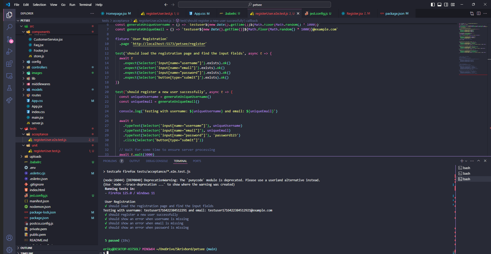

## Test Report for automated tests

## 2024-05-23

### Test Environment
- **Development Tools:** VSCode
- **Browser:** Google Chrome, Firefox
- **Database:** MongoDB
- **Framework:** [React, MongoDB, node.js, express, Jest]

## Register.jsx

### Unit Tests
1. Successful Registration
   - Fill out registration form.
   - Check the correct API endpoint is called.
2. Failed Registration
   - Mock a failure response and verify the error is handled correctly.
   - Check for various failure messages (e.g., different error codes).
  
- **Result 1st test:** [PASS 4/6]
- **Failed tests:**

1. throws an error when email is missing
2. throws an error when password is missing

- **Result 2nd test:** [PASS 6/6]

### Acceptance Tests (E2E)
1. Successful Registration Flow
   - Fill out the registration form.
   - Submit the form.
   - Verify that the user is redirected to the login page.
2. Failed Registration Flow
   - Fill out the registration form with invalid data.
   - Submit the form.
   - Verify that the appropriate error message is displayed.

- **Result:** [PASS 5/5]

## Login.jsx
Unit tests for the loginUser function and acceptance tests for the login flow.

### Unit Tests
1. Successful Login
   - Mock a successful login response.
   - Verify that the correct data is returned and stored (e.g., access token).
2. Failed Registration
   - Mock different failure responses (e.g., 401, 404).
   - Verify the appropriate error messages are shown.

- **Result:** [PASS 4/4]

### Acceptance Tests (E2E)
1. Successful Login Flow
   - Fill out the login form.
   - Submit the form.
   - Verify that the user is redirected to the homepage.
2. Failed Login Flow
   - Fill out the login form with incorrect credentials.
   - Submit the form.
   - Verify that the appropriate error message is displayed.

- **Result:** [PASS 2/2]

## AddActivity.jsx
Unit tests for form validation and submission, and acceptance tests for adding activities.

### Unit Tests
1. Form Validation
   - Verify that empty fields show validation errors.
2. Successful Activity Submission
   - Mock a successful API response.
   - Verify the activity details are correctly sent and processed.
3. Failed Activity Submission
   - Mock a failure API response.
   - Verify the error is handled correctly.

- **Result:** [DID NOT START]
- **Failed tests:**

### Acceptance Tests (E2E)
1. Add Activity Flow
   - Fill out the activity form.
   - Submit the form.
   - Verify that the activity is added and the user is redirected.

- **Result:** [DID NOT START]
- **Failed tests:**

## AddMeal.jsx
Unit tests for the diet calculation and form submission, and acceptance tests for adding meals.

### Unit Tests
1. Nutrient Calculation
   - Verify that nutrient calculations are correct based on quantity and selected brand.
2. Successful Meal Submission
   - Mock a successful API response.
   - Verify the meal details are correctly sent and processed.
3. Failed Meal Submission
   - Mock a failure API response.
   - Verify the error is handled correctly.

- **Result:** [DID NOT START]
- **Failed tests:**

### Acceptance Tests (E2E)
1. Add Meal Flow
   - Fill out the activity form.
   - Submit the form.
   - Verify that the meal is added and the user is redirected.

- **Result:** [DID NOT START]
- **Failed tests:**

## PetDetails.jsx
Unit tests for the pet details form validation and submission, and acceptance tests for saving/updating pet details.

### Unit Tests
1. Form Validation
   - Verify that required fields show validation errors if left empty.
2. Successful Pet Details Submission
   - Mock a successful API response.
   - Verify the pet details are correctly sent and processed.
3. Failed Pet Details Submission
   - Mock a failure API response.
   - Verify the error is handled correctly.

- **Result:** [DID NOT START]
- **Failed tests:**

### Acceptance Tests (E2E)
1. Add/Update Pet Details Flow
   - Fill out the pet details form.
   - Submit the form.
   - Verify that the details are saved.

- **Result:** [PASS 1/1]

## EditToDoList.jsx
Unit tests for task retrieval and update/delete operations, and acceptance tests for editing tasks.

### Unit Tests
1. Retrieve Task
   - Mock the API response for task retrieval.
   - Verify the task details are correctly displayed.
2. Update Task
   - Mock a successful API response for updating.
   - Verify the task is updated.
3. Delete Task
   - Mock a successful API response for deleting.
   - Verify the task is deleted.

- **Result:** [PASS 6/6]

### Acceptance Tests (E2E)
1. Edit Task Flow
   - Retrieve an existing task.
   - Update the task details.
   - Verify the task is updated.
2. Delete Task Flow
   - Retrieve an existing task.
   - Delete the task.
   - Verify the task is deleted.

- **Result:** [DID NOT START]
- **Failed tests:**

## Homepage.jsx
Acceptance tests for navigating through the homepage and verifying data.

### Acceptance Tests (E2E)
1. Navigate to Diet Details
   - Navigate to the diet details page.
   - Verify that the diet details are correctly displayed.
2. Navigate to Activity Details
   - Navigate to the activity details page.
   - Verify that the activity details are correctly displayed.
3. Navigate to Schedule Details
   - Navigate to the schedule details page.
   - Verify that the schedule details are correctly displayed.
4. Navigate to To-Do List
   - Navigate to the to-do list page.
   - Verify that the to-do list items are correctly displayed.

- **Result:** [PASS 4/6]
- **Failed tests:**

### Test Suite: Progress Bar

### Test Case 11.1: Visible progress bar for Diet
**Objective:** Verify that a circular progress bar for Diet is visible.
- **Input:** Log in.
- - **Expected Output:** Displays a circular Progress Bar for Diet.
- **Result:** [PASS]
- **Screenshots:** 
- **Comments:**

### 11.2: Visible progress bar for Activity
**Objective:** Verify that a circular progress bar for Activity is visible.
- **Input:** Log in.
- **Expected Output:** Displays a circular Progress Bar for Activity.
- **Result:** [PASS]
- **Screenshots:** 
- **Comments:**

### 11.3: Show progress Diet
**Objective:** Verify that a circular progress bar for Diet is showing the progress in percentages.
- **Input:** Log in.
Navigate to Diet.
Create a and save a new meal.
- **Expected Output:** The progress bar for diet should update.
Displays the updated progress bar for diet.
- **Result:** [PASS]
- **Screenshots:** 
- **Comments:**

### 11.4: Show progress for activity
**Objective:** Verify that a circular progress bar for Activity is showing the progress in percentages.
- **Input:** Log in.
Navigate to Acvitiy.
Create and save a new activity.
- **Expected Output:** The progress bar for activity should update.
Displays the updated progress bar for activity.
- **Result:** [PASS]
- **Screenshots:** 
- **Comments:**

### Summary
- **Overall Success Rate:** [4 out of 4]
- **General Comments:** The circular progress bars appear and work correctly. When the user adds a meal or an activity, the progress bars update automatically, based on the pet's Calorie Goald and Activites Goal.

