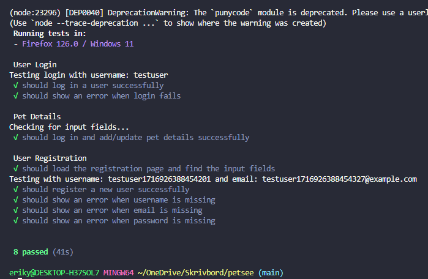
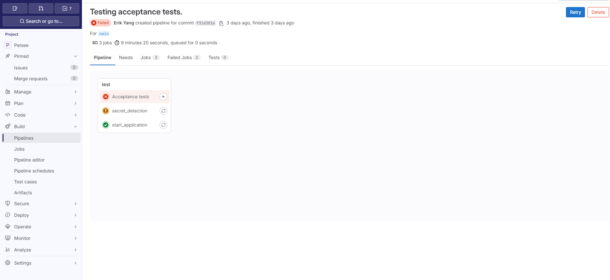
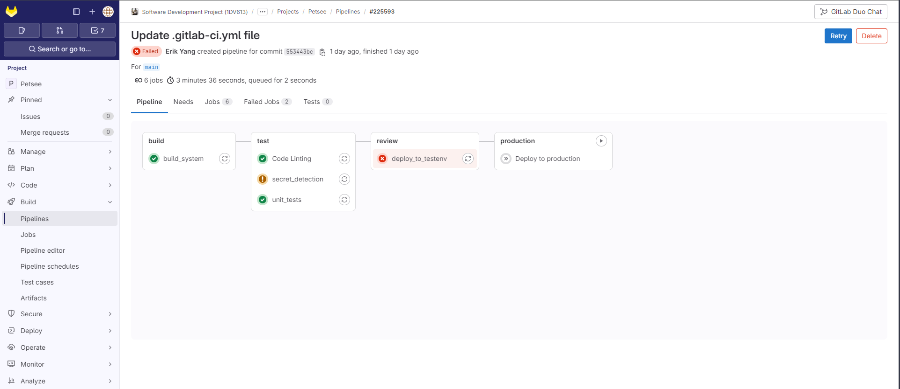
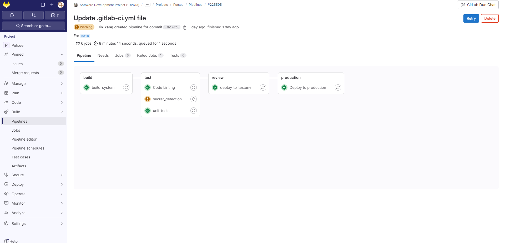
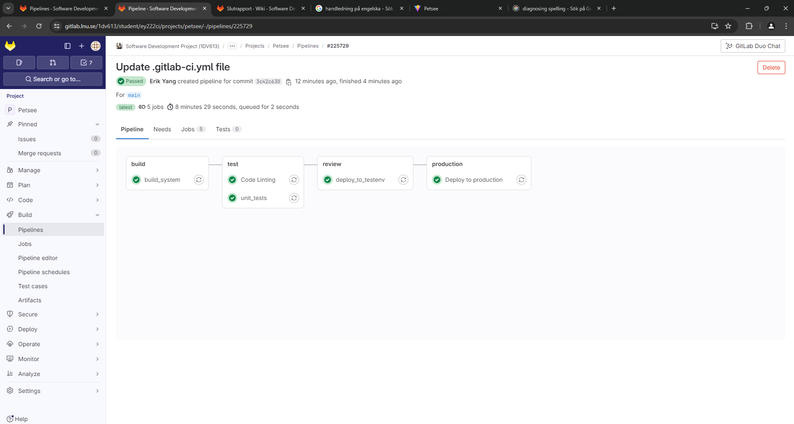

# Summary report Automated tests

## Unit tests

### Register.jsx

1. Successful Registration
   - Fill out registration form.
   - Check the correct API endpoint is called.
2. Failed Registration
   - Mock a failure response and verify the error is handled correctly.
   - Check for various failure messages (e.g., different error codes).

### Login.jsx
Unit tests for the loginUser function and acceptance tests for the login flow.

1. Successful Login
   - Mock a successful login response.
   - Verify that the correct data is returned and stored (e.g., access token).
2. Failed Registration
   - Mock different failure responses (e.g., 401, 404).
   - Verify the appropriate error messages are shown.

### EditToDoList.jsx
Unit tests for task retrieval and update/delete operations, and acceptance tests for editing tasks.

1. Retrieve Task
   - Mock the API response for task retrieval.
   - Verify the task details are correctly displayed.
2. Update Task
   - Mock a successful API response for updating.
   - Verify the task is updated.
3. Delete Task
   - Mock a successful API response for deleting.
   - Verify the task is deleted.

## Acceptance tests (e2e)

### Register.jsx

1. Successful Registration Flow
   - Fill out the registration form.
   - Submit the form.
   - Verify that the user is redirected to the login page.
2. Failed Registration Flow
   - Fill out the registration form with invalid data.
   - Submit the form.
   - Verify that the appropriate error message is displayed.

### Login.jsx

1. Successful Login Flow
   - Fill out the login form.
   - Submit the form.
   - Verify that the user is redirected to the homepage.
2. Failed Login Flow
   - Fill out the login form with incorrect credentials.
   - Submit the form.
   - Verify that the appropriate error message is displayed.

### Petdetails.jsx

1. Add/Update Pet Details Flow
   - Fill out the pet details form.
   - Submit the form.
   - Verify that the details are saved.

# CI/CD pipeline tests

## Failed acceptance test

### Comments
I tried implementing acceptance (e2e) tests in the test stage of the pipeline. The same ones that run succesfully on my PC. But for some reason I always ended up having problem with the browser/headless browser not opening or working properly.

## Failed deploy test

### Comments
Here I had to adjust some code in the .yml file, such as removing node modules and package-lock.json and then using npm install in the "before_script" phase.

## Failed secret detection

### Comments
I never got this part to work properly.

## Passed Pipeline

### Comments
- I ended up removing the acceptance tests and the secret detection test. All other stages of the pipeline run succesfully.
- The application updates changes automatically after the "deploy to production" stage is finished.

- I am safely storing the ssh key for the login to the ubuntu server along with the private.pem and the public.pem for coding and decoding the Jwt in GitLab settings as variables. 

