2024-04-11

>* Test enviroment: VScode, google chrome, web browser, mongoDB.

### Test Start Page

#### Test Case 1.1: Successful display of start page
#### Objective: Verify that the user is met by a sleek and easy to navigate start page

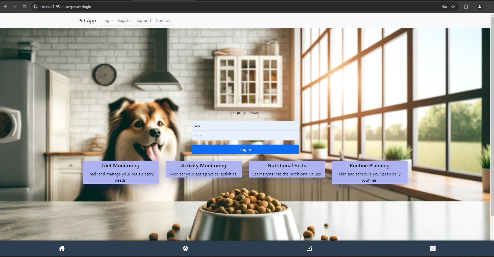

#### Test Case 1.2: Register/Login from start page
#### Objective: Ensure the start page has links to register/login.

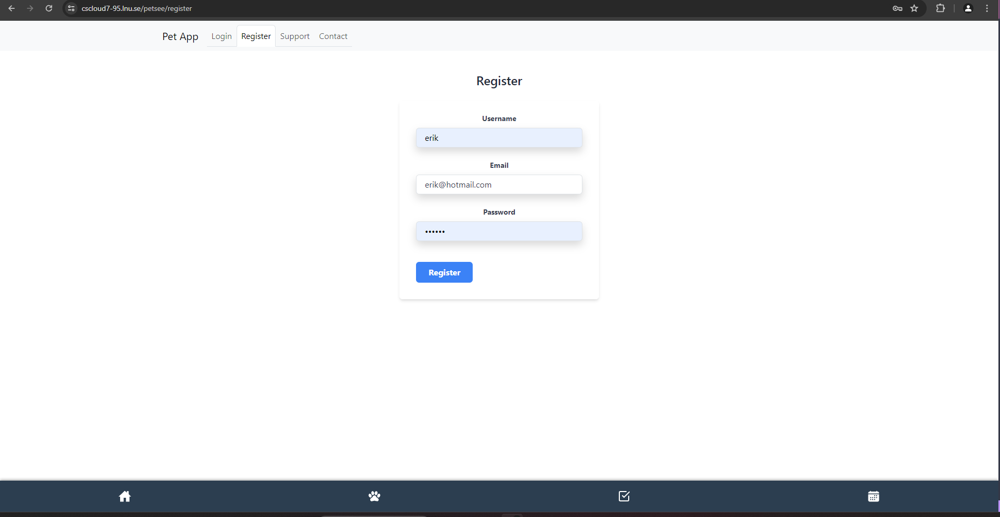

### Test User Registration

#### Test Case 2.1: Successful User Registration
#### Objective: Verify that new users can register successfully using valid credentials.

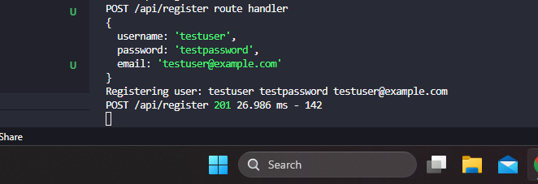
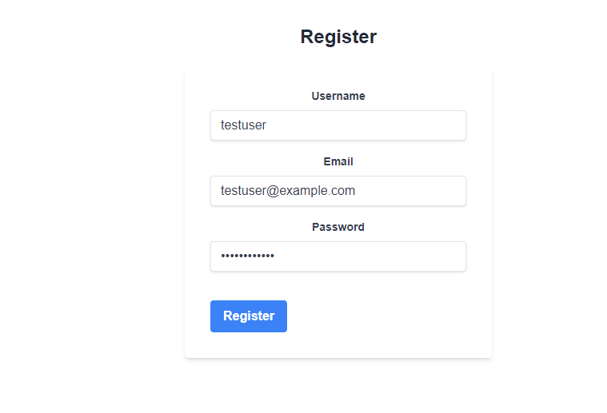

#### Test Case 2.2: Failed Registration - Duplicate Username
#### Objective: Ensure the registration process validates for duplicate usernames.

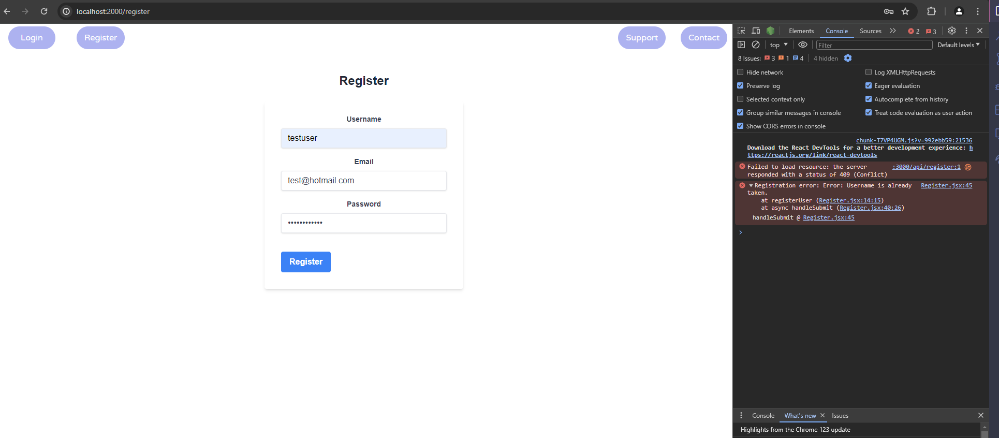

Comment 2.2: Test case failed. The error message "Username is already taken" is correct, but it only shows in console and not in the browser for the user to see.

#### Test Case 2.3: Failed Registration - Duplicate Email
#### Objective: Ensure the registration process checks for duplicate email addresses.

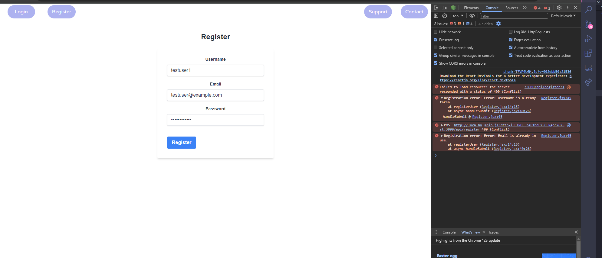

Comment 2.3: Test case failed. The error message "Email is already in use" is correct, but it only shows in console and not in the browser for the user to see.

#### Test Case 2.4: Failed Registration - Empty Fields
#### Objective: Validate that all fields (username, password, email) are required.

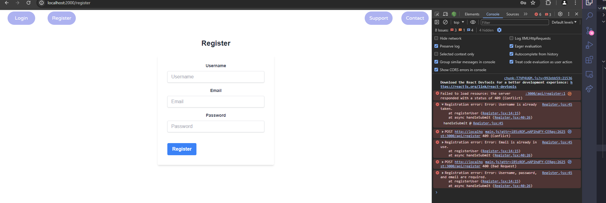

Comment 2.4: Test case failed. The error message "Username, password, and email are required" is correct, but it only shows in console and not in the browser for the user to see.

#### Test Case 2.5: Failed Registration - Invalid Email Format
#### Objective: Ensure that the email field validates for correct email format.

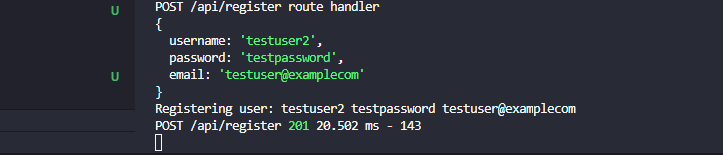

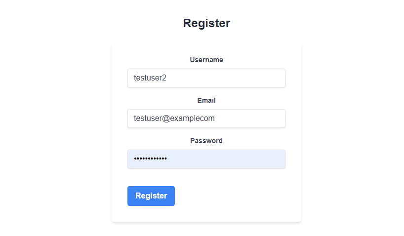

Comment 2.5: Test case failed. The user is able to input an email adress without a '.' (dot) in the email name: (testuser@examplecom)

| Test      | UC1  | UC2  |
| --------- |:----:| :---:|
| TC2.1     | 1/OK | 0    |
| TC2.2     | 0/OK | 0    |
| TC2.3     | 0/OK | 0    |
| TC2.4     | 0/OK | 0    |
| TC2.5     | 0/OK | 0    |
| COVERAGE & SUCCESS   | 1/OK    | 0    |

### comment

Although the error messages are correctly formulated and triggered, they don't show on the user's interface. I have to implement flash messages in order for the user to be instructed what went wrong.

2024-04-14

### Test User Authentication

>* Test enviroment: VScode, google chrome, web broswer, mongoDB.

#### Test Case 3.1: Successful Login
#### Objective: Verify that users can log in with correct credentials.

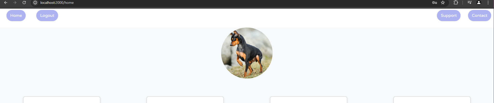

#### Test Case 3.2: Failed Login - Empty Credentials
#### Objective: Ensure the login form validates the requirement of username and password.

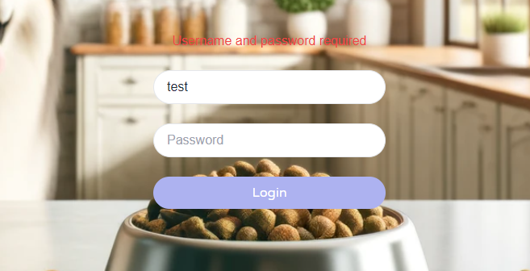
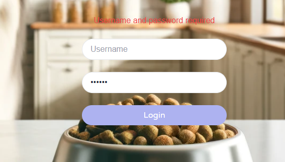

#### Test Case 3.3: Failed Login - Incorrect Credentials - Incorrect username
#### Objective: Ensure the system correctly handles incorrect login credentials.

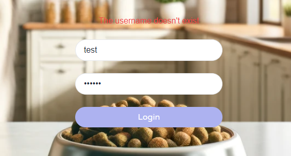

#### Test Case 3.4: Failed Login - Incorrect Credentials - Incorrect password
#### Objective: Ensure the system correctly handles incorrect login credentials.

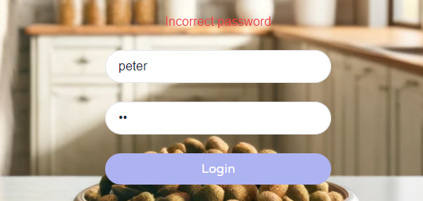

| Test      | UC1  | UC2  |
| --------- |:----:| :---:|
| TC3.1     | 1/OK | 0    |
| TC3.2     | 1/OK | 0    |
| TC3.3     | 1/OK | 0    |
| TC3.4     | 1/OK | 0    |
| COVERAGE & SUCCESS   | 4/OK    | 0    |

### Comment

All tests pass. The login logic seems robust and reliable. 
