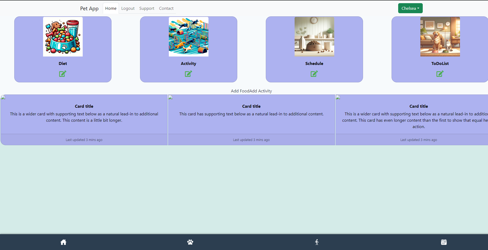
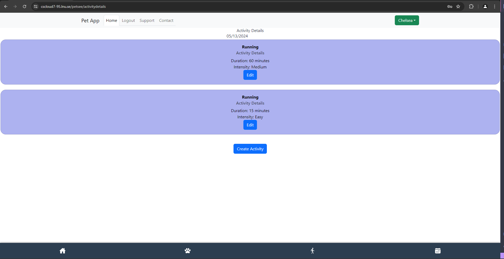
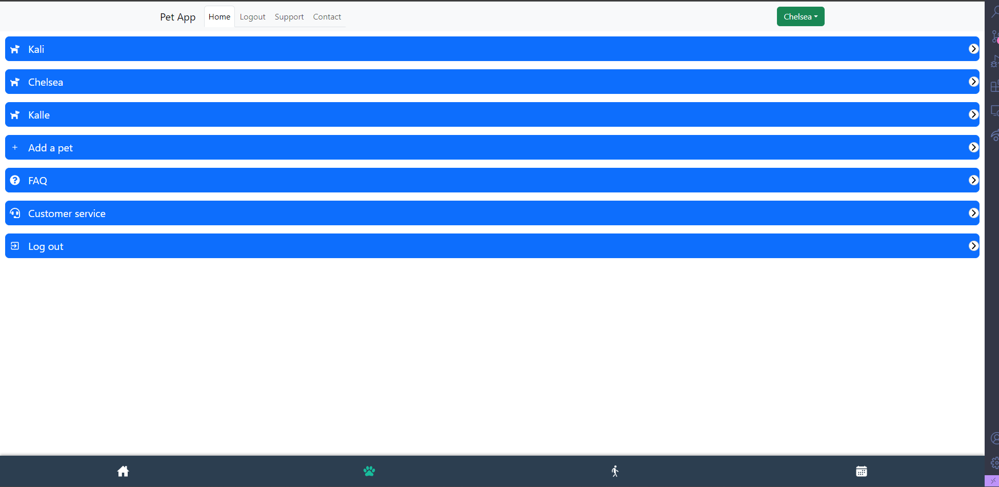
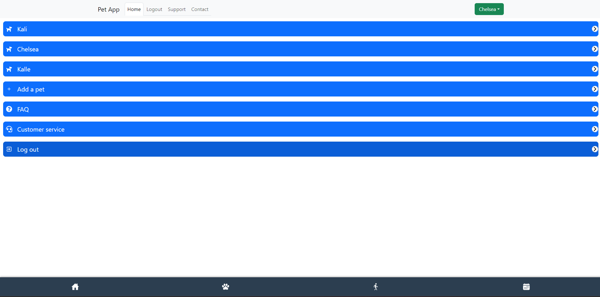
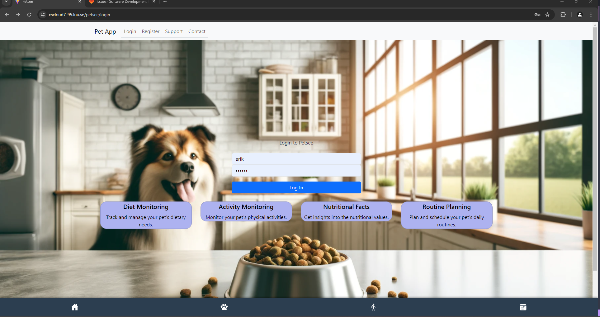
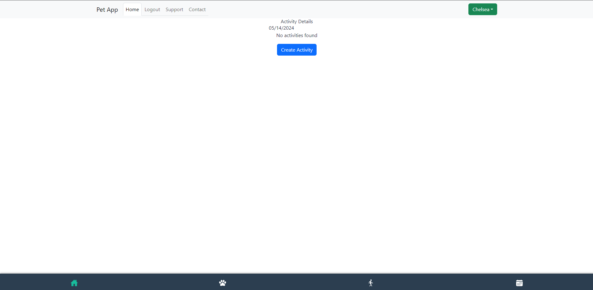
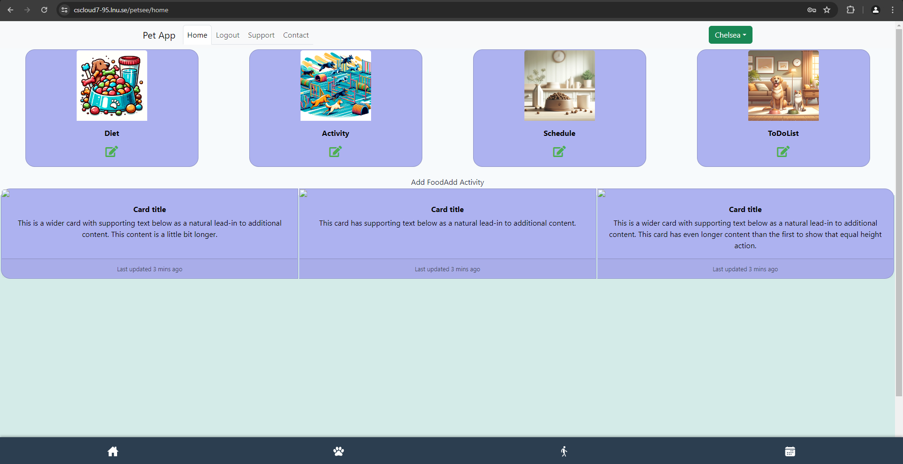
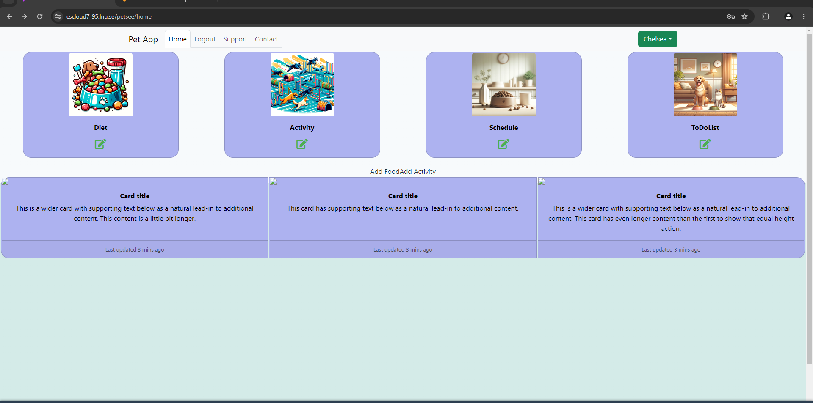
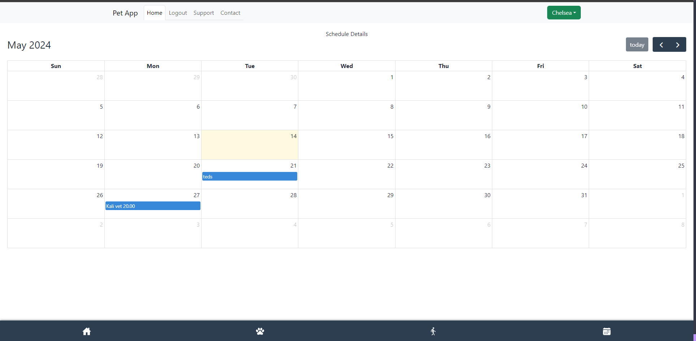

## Test Report for Dock

## 2024-05-14

### Test Environment
- **Development Tools:** VSCode
- **Browser:** Google Chrome
- **Database:** MongoDB
- **Framework:** [React, MongoDB, node.js, express]

### Test Suite: Multiple Pets

### Test Case 9.1: Display Dock
**Objective:** Verify that a Dock displays at the bottom of the page.
- **Input:** Log in.
- **Expected Output:** A dock should be visible at the bottom at the page.
Displays Dock.
- **Result:** [PASS]
- **Screenshots:** 
- **Comments:**

### Test Case 9.2: Dock always visible
**Objective:** Verify that the Dock is always visible, no matter what page the user is currently on.
- **Input:** Log in and navigate to "Activity".
- **Expected Output:** The Dock should still be visble to the user no matter which page the user is on.
Displays the Dock.
- **Result:** [PASS]
- **Screenshots:**  
- **Comments:**

### Test Case 9.3: More Page
**Objective:** Verify that the user can navitage to the "More" page via the Dock.
- **Input:** Log in and click on the dog paw on the dock (More).
- **Expected Output:** The More page should display with additional functions. 
Displays More page.
- **Result:** [PASS]
- **Screenshots:**  
- **Comments:**

### Test Case 9.4: Logout from Dock
**Objective:** Verify that the user can logout from the Dock.
- **Input:** Log in and click on the dog paw on the dock (More).
Click the logout Button.
- **Expected Output:** The user should log out and be redirected to the Login page.
Displays Login page.
- **Result:** [PASS]
- **Screenshots:**    
- **Comments:**

### Test Case 9.5: Redirect to Home from the Dock.
**Objective:** Verify that the user can navigate to the Home page from the Dock.
- **Input:** Log in and click on the dog paw on the dock (More).
Click on the House icon on the dock (Home).
- **Expected Output:** The user should be redirected to the Home page.
Displays Home page.
- **Result:** [PASS]
- **Screenshots:**    
- **Comments:**

### Test Case 9.6: Open the Calendar (ScheduleDetails) from Dock.
**Objective:** Verify that the user can navigate to the calendar page from the Dock.
- **Input:** og in and click on the calendar icon on the dock (ScheduleDetails).
- **Expected Output:** The user should be redirected to the ScheduleDetails.
Displays Calendar
- **Result:** [PASS]
- **Screenshots:**    
- **Comments:**

### Summary
- **Overall Success Rate:** [6 out of 6]
- **General Comments:** The logic for the Dock is working correctly. From the Dock the user is able to reach practical functions at all times, including adding a net pet, checking the calendar and to log out. 