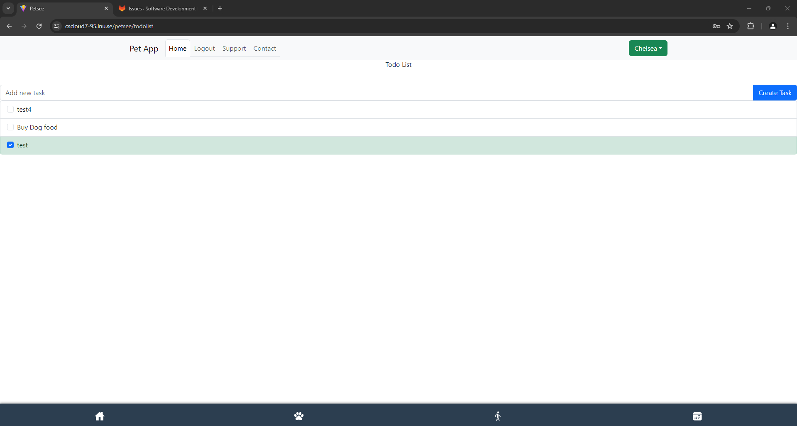
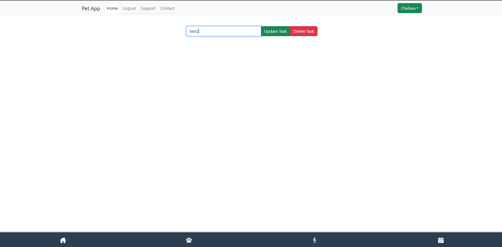
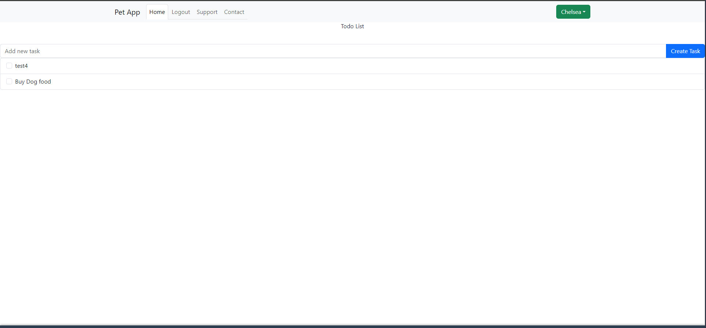
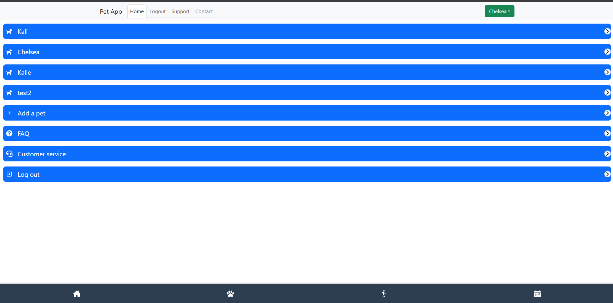
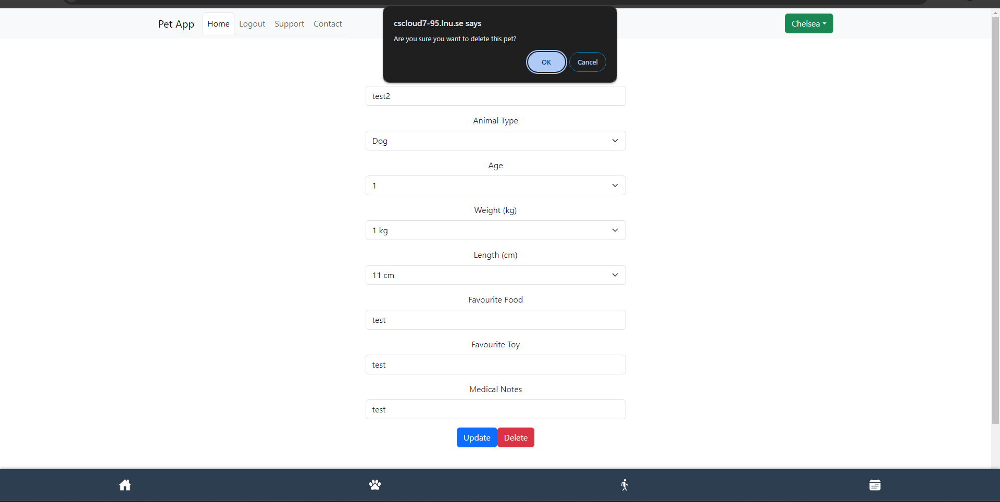
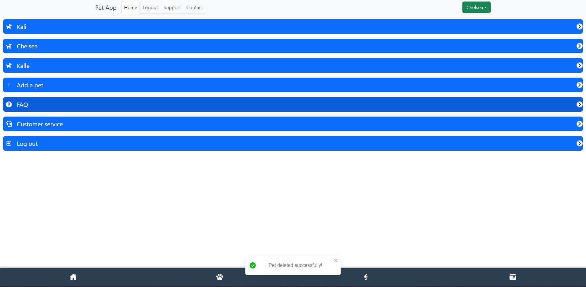

## Test Report for To-do List

## 2024-05-14

### Test Environment
- **Development Tools:** VSCode
- **Browser:** Google Chrome
- **Database:** MongoDB
- **Framework:** [React, MongoDB, node.js, express]

### Test Suite: Multiple Pets

### Test Case 10.1: To-do List function
**Objective:** Verify that a To-Do list function displays on the application.
- **Input:** Log in.
- **Expected Output:** Displays a clickable card ToDoList.
- **Result:** [PASS]
- **Screenshots:** 
- **Comments:**

### Test Case 10.2: Create new task
**Objective:** Verify that the user can navigate to the To-do List page and create a new task
- **Input:** Log in and click on the ToDoList card. Input "test" in the input field and click the button "Create Task"
- **Expected Output:** The task "test" should display on the dashboard.
Displays the "test" task.
- **Result:** [PASS]
- **Screenshots:**  
- **Comments:**

### Test Case 10.3: checkbox to indigate if task is completed.
**Objective:** Verify that the user can click the checkbox next to the task name to indicate completion.
- **Input:** Log in and click on the ToDoList card.
CLick the checkbox next to the task "test"
- **Expected Output:** The checkbox should be filled and the task overwritten with a line indicating completion of the task.
Displays the changed state of the task.
- **Result:** [PASS]
- **Screenshots:**  
- **Comments:**

### Test Case 10.4: Edit task
**Objective:** Verify that the user can edit a task.
- **Input:** Log in and click on the ToDoList card.
Click on the "test" task.
Change text from "test" to "test2".
CLick the "Update Task button.
- **Expected Output:** The user should be navigated to the edit task page.
Displays the task with buttons to update or delete task.
The task should be updated with the new task "test".
Displays the updated task.
- **Result:** [PASS]
- **Screenshots:**    
- **Comments:**

### Test Case 10.5: Delete task
**Objective:** Verify that the user can delete a task.
- **Input:** Log in and click on the ToDoList card.
Click on the "test2" task.
CLick the "Delete" Task button.
- **Expected Output:** The user should be navigated to the edit task page.
Displays the task with buttons to update or delete task.
The task should be deleted and removed from the dashboard.
Displays the updated dashboard without the task "test2".
- **Result:** [PASS]
- **Screenshots:**    
- **Comments:**

### Summary
- **Overall Success Rate:** [5 out of 5]
- **General Comments:** The logic for the To-do List is working correctly. The user is able to add, edit and delete tasks. Aditionally, the user can check the check box of the task to indicate completion of task.

## Test Report for Pet Details Management

## 2024-05-14

### Test Environment
- **Development Tools:** VSCode
- **Browser:** Google Chrome
- **Database:** MongoDB
- **Framework:** [React, MongoDB, node.js, express]

### Test Suite: Pet Details Management

### Test Case 4.1: View Pet Details on More page
**Objective:** Verify that users can view details of their pets.
- **Input:** Log in successfully.
Click on the dog paw icon on the Dock (more).
- **Expected Output:** Displays a "More" page with the user's added pets.
- **Result:** [PASS]
- **Screenshots:** 
- **Comments:**

### Test Case 4.2: Add new pet
**Objective:** Verify that users can add multiple pets.
- **Input:** Log in successfully.
Click on the dog paw icon on the Dock (more).
Click on the "Add pet" button
Fill in the name "test" and click "Save Pet Details.
- **Expected Output:** The user is redirected to a form.
Displays input fields/drop down menus for pet's name, age, animal type, weight, length, favouriteFood, favouriteToy and medical notes.
The new Pet is saved and added to the user.
The new Pet "test" is displayed on the "more" page.
- **Result:** [PASS]
- **Screenshots:**  
- **Comments:**

### Test Case 4.3: Edit Pet Details
**Objective:** Ensure users can edit the details of a pet.
- **Input:** Log in successfully.
Click on the dog paw icon on the Dock (more).
Click on the pet named "test"
Change the name to "test2"
Click on "update".
- **Expected Output:** An edit page of the pet's details should appear.
The pet's name (test) should be changed to "test2" and appear on the more page.
Displays the updated name of the pet.
- **Result:** [PASS]
- **Screenshots:**  
- **Comments:**

### Test Case 4.4: Delete a pet
**Objective:** Ensure that the user can delete a pet.
- **Input:** Click on the dog paw icon on the Dock (more).
Click on the pet named "test2"
CLick on the delete" button.
Update changes.
- **Expected Output:** A warning message appears warning the user about the deletion.
Deletes the pet.
Displays updated more page without the pet named test2.
- **Result:** [PASS]
- **Screenshots:**    
- **Comments:**

### Summary
- **Overall Success Rate:** [4 out of 4]
- **General Comments:** The logic for the Petdetails management is working correctly. The user is able to add, edit and delete pets using the dock and navigating to the "more" page. Aditionally